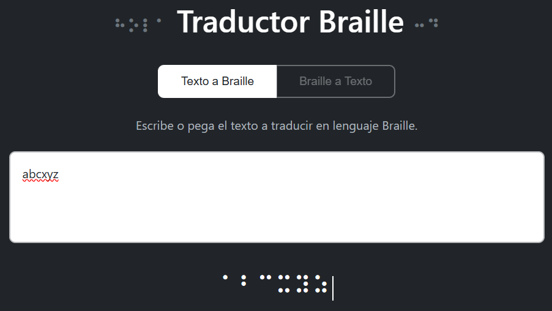
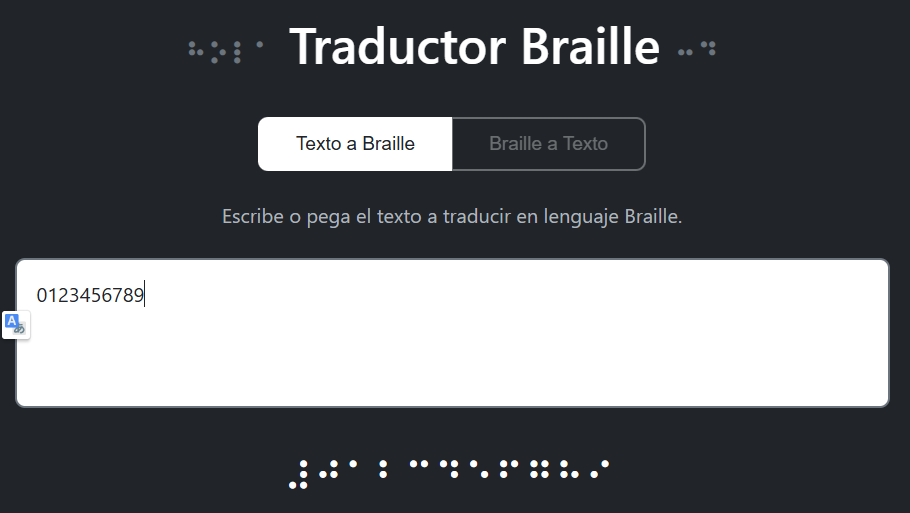
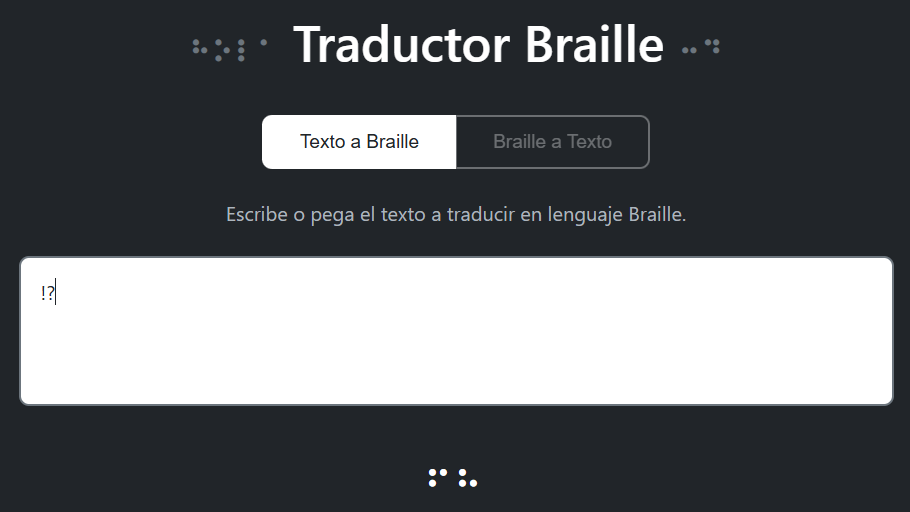

# Casos de Prueba Propuestos

Este documento propone un conjunto de pruebas (unitarias, de integración y manuales) para verificar el correcto funcionamiento del proyecto.

## 1) Pruebas unitarias (función `texto_a_braille`)

Recomendado usar `pytest`.
- Caso: letras minusculas
  - Entrada: `"abcxyz"`
  - Esperado: cada caracter mapeado correctamente según `BRAILLE_MAP`.

- Caso: números
  - Entrada: `"0123456789"`
  - Esperado: mapeo correcto (ver `BRAILLE_MAP`).

  
- Caso: puntuación y espacio
  - Entrada: `"Hola, mundo."`
  - Esperado: comas y puntos convertidos y espacios preservados.

  

- Caso: caracteres no convecionales
  - Entrada: `"!?"`
  - Esperado: los caracteres mapeados se devuelven sin provocar fallos de traducción.

  

- Caso: cadena vacía
  - Entrada: `""`
  - Esperado: `""` (cadena vacía) o manejo definido.

  

## Pruebas a consideraciones futuras:

### 2) Pruebas de accesibilidad

- Verificar navegación por teclado (TAB para focos, botones activables con Enter/Space).
- Probar con lector de pantalla (NVDA, VoiceOver) y comprobar que las secciones son legibles.
- Comprobar contraste de colores y tamaño de fuente adaptables.

### 3) Pruebas de rendimiento

- Medir latencia para textos de diferentes tamaños (por ejemplo: 1KB, 10KB, 100KB).
- Determinar throughput concurrente con herramientas como `ab` o `wrk` si se despliega detrás de un servidor WSGI.

### 4) Pruebas de seguridad

- Limitar tamaño de payload para prevenir DoS.
- Validar que la API no ejecuta código o realiza operaciones peligrosas con la entrada.

### 5) Casos de prueba extra y regresión

- Mantener un conjunto de pruebas automatizadas en `tests/` y ejecutarlas en CI (GitHub Actions, etc.).

## Checklist de aceptación

-  Conversión correcta para letras básicas.
-  UI muestra y copia correctamente el resultado.
- Aplicación arranca en entorno virtual con `pip install -r requirements.txt`.
-  Pruebas unitarias y de integración pasan en CI.
