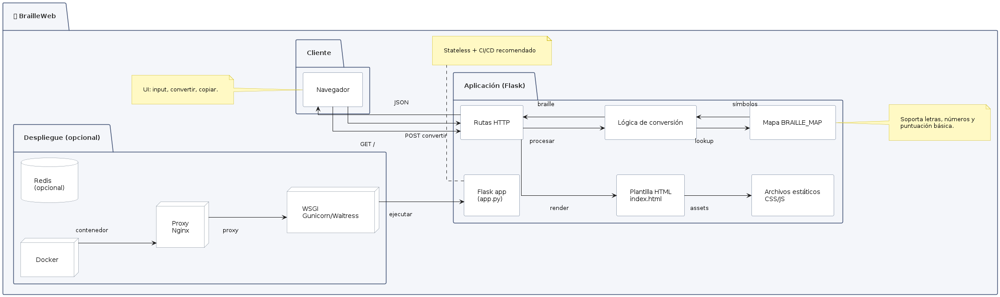

# Diseño Arquitectónico

## Resumen

Esta aplicación es una web simple basada en Flask que convierte texto en símbolos Braille Unicode. Está diseñada como una aplicación monolítica y ligera, adecuada para despliegues locales o en contenedores.

## Componentes principales

- **Backend (Flask)**
  - Archivo principal: `app.py`.
  - Rutas:
    - `GET /` — Sirve la plantilla `index.html`.
    - `POST /convertir` — Recibe JSON `{ "texto": "..." }` y devuelve el texto convertido.
  - Lógica de conversión: función `texto_a_braille(texto)` que usa el diccionario `BRAILLE_MAP`.

- **Frontend**
  - Plantilla: `templates/index.html`.
  - Estilos: `static/css/style.css`.
  - JavaScript inline en `index.html` que gestiona la llamada `fetch('/convertir')`, muestra resultados y copia al portapapeles.

## Flujo de datos

1. Usuario escribe texto en la UI.
2. JS envía `POST /convertir` con el texto en JSON.
3. Flask procesa la solicitud, convierte carácter por carácter usando `BRAILLE_MAP`.
4. Flask devuelve JSON con `texto_braille`.
5. Frontend muestra el resultado y ofrece copiar al portapapeles.

## Diagrama (texto)

La siguiente imagen muestra, de forma visual, la disposición de los componentes
de la aplicación y el flujo de datos entre el cliente y el backend. 



**Cliente (Navegador)**: UI
  (área de texto, botón "Convertir", botón "Copiar").

**Aplicación (Flask)** como un contenedor que
  agrupa:
  - **Rutas HTTP** (`GET /` para la plantilla y `POST /convertir` para la API).
  - **Plantilla** (`templates/index.html`) y **archivos estáticos** (CSS/JS).
  - **Lógica de conversión** (`texto_a_braille(texto)`) que procesa la entrada.
  - **Mapa `BRAILLE_MAP`** que actúa como tabla de consulta (carácter → símbolo).

Para una futura actualización de la ar
**Despliegue (opcional)** con
  contenedores (`Docker`), proxy (`Nginx`), servidor WSGI (gunicorn/waitress)
  y componentes opcionales como `Redis` para caching.


## Almacenamiento

No hay persistencia — la aplicación es stateless y no almacena texto ni logs por defecto.

## Consideraciones Opcionales
### Despliegue recomendado

- Para desarrollo: ejecutar `python app.py`.
- Para producción:
  - Usar un servidor WSGI (por ejemplo: `gunicorn` o `waitress` en Windows).
  - Colocar detrás de un proxy inverso (Nginx) si es necesario.
  - Contenerizar con Docker para despliegues reproducibles.

Ejemplo mínimo `Dockerfile` (sugerido):

```dockerfile
FROM python:3.11-slim
WORKDIR /app
COPY . /app
RUN pip install --no-cache-dir -r requirements.txt
EXPOSE 5000
CMD ["python", "app.py"]
```

### Escalabilidad y mejoras posibles

- Separar en servicio API independiente y frontend estático servido por CDN.
- Añadir cache para conversiones frecuentes (por ejemplo, Redis).
- Soporte de colas y procesamiento por lotes para textos muy largos.
- Internacionalización y soporte de mayúsculas con indicador Braille.
- Añadir tests automatizados y pipeline CI/CD.

### Seguridad

- Validar y limitar el tamaño de la carga JSON para evitar DoS.
- Evitar la ejecución de código desde entradas de usuario (no aplicable actualmente).
