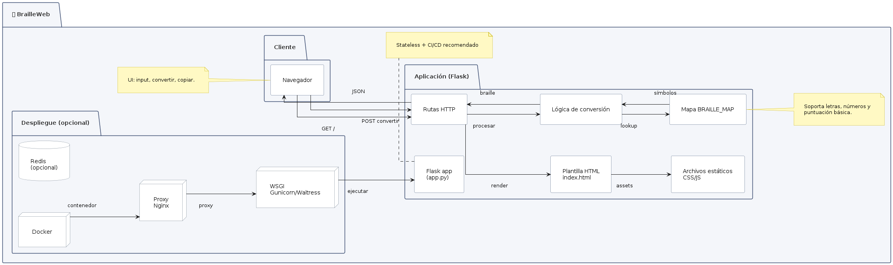

<div align="center">
  <h2>Escuela Politecnica Nacional</h2>
  <h3>Facultad de Ingeniería de Sistemas</h3>
  <h4>Construcción y Evolución de Software</h4>
  
  <hr width="60%">
  
  <br>
  
  <table align="center">
    <tr>
      <td><b>Versión:</b></td>
      <td>2.0</td>
    </tr>
    <tr>
      <td><b>Grupo:</b></td>
      <td>5</td>
    </tr>
    <tr>
      <td><b>Fecha:</b></td>
      <td>Enero 2026</td>
    </tr>
  </table>
</div>

<div style="page-break-after: always;"></div>

---

# Diseño Arquitectónico

## Resumen

Esta aplicación es una web bidireccional basada en Flask que convierte texto en símbolos Braille Unicode y viceversa. Está diseñada como una aplicación monolítica y ligera, adecuada para despliegues locales o en contenedores. La arquitectura sigue el patrón MVC (Model-View-Controller) adaptado a Flask.

---

## Componentes principales

### Backend (Flask)

#### Archivo principal: `app.py`

El backend implementa la lógica de conversión bidireccional y gestiona las rutas HTTP.

#### Rutas HTTP

##### 1. `GET /` — Página Principal
- **Descripción**: Sirve la plantilla HTML principal (`index.html`)
- **Método**: GET
- **Respuesta**: HTML renderizado
- **Uso**: Punto de entrada de la aplicación web

##### 2. `GET /contexto` — Página Informativa
- **Descripción**: Sirve información contextual sobre el sistema Braille
- **Método**: GET
- **Respuesta**: HTML renderizado (`contexto.html`)

##### 3. `GET /sobre-nosotros` — Página Acerca De
- **Descripción**: Información sobre el equipo de desarrollo
- **Método**: GET
- **Respuesta**: HTML renderizado (`sobre-nosotros.html`)

##### 4. `POST /convertir` — Conversión Texto → Braille
- **Descripción**: Convierte texto español a Braille Unicode
- **Método**: POST
- **Content-Type**: application/json
- **Body esperado**:
  ```json
  {
    "texto": "Hola mundo"
  }
  ```
- **Respuesta exitosa** (200):
  ```json
  {
    "texto_braille": "⠨⠓⠕⠇⠁⠀⠍⠥⠝⠙⠕"
  }
  ```
- **Respuesta de error** (400):
  ```json
  {
    "error": "No se proporcionó texto"
  }
  ```
- **Lógica**: Utiliza la función `texto_a_braille(texto)`

##### 5. `POST /convertir-braille` — Conversión Braille → Texto
- **Descripción**: Convierte Braille Unicode a texto español
- **Método**: POST
- **Content-Type**: application/json
- **Body esperado**:
  ```json
  {
    "braille": "⠓⠕⠇⠁"
  }
  ```
- **Respuesta exitosa** (200):
  ```json
  {
    "texto": "hola"
  }
  ```
- **Respuesta de error** (400):
  ```json
  {
    "error": "No se proporcionó texto braille"
  }
  ```
- **Lógica**: Utiliza la función `braille_a_texto(braille)`

##### 6. `POST /validar-braille` — Validación Contextual (NUEVO)
- **Descripción**: Valida si un carácter Braille es válido según el modo activo
- **Método**: POST
- **Content-Type**: application/json
- **Body esperado**:
  ```json
  {
    "braille": "⠇",
    "modo": "letra"
  }
  ```
- **Parámetros**:
  - `braille` (string): Carácter Braille Unicode a validar
  - `modo` (string): Modo de validación: `"letra"`, `"numero"` o `"especial"`

- **Respuesta exitosa** (200):
  ```json
  {
    "ok": true,
    "caracter": "⠇",
    "traduccion": "l"
  }
  ```

- **Respuestas de error** (400):
  
  **Sin carácter**:
  ```json
  {
    "error": "No se proporcionó carácter Braille"
  }
  ```
  
  **Carácter inválido en modo letra**:
  ```json
  {
    "error": "No es una letra o signo válido en modo letra"
  }
  ```
  
  **Carácter inválido en modo número**:
  ```json
  {
    "error": "No es un número Braille válido (0-9)"
  }
  ```
  
  **Carácter inválido en modo especial**:
  ```json
  {
    "error": "No es un carácter especial reconocido"
  }
  ```
  
  **Modo no reconocido**:
  ```json
  {
    "error": "Modo no reconocido"
  }
  ```

- **Lógica de validación**:
  - **Modo letra**: Valida contra `BRAILLE_TO_TEXT` (letras, ñ, tildes, signos básicos)
  - **Modo número**: Valida contra `BRAILLE_TO_NUMBER` (dígitos 0-9)
  - **Modo especial**: Valida contra `BRAILLE_TO_TEXT` (signos de puntuación)

##### 7. `POST /descargar-braille-word` — Exportación a Word Espejo
- **Descripción**: Genera un documento .docx con Braille invertido para perforación
- **Método**: POST
- **Content-Type**: application/json
- **Body esperado**:
  ```json
  {
    "braille": "⠓⠕⠇⠁",
    "texto": "hola"
  }
  ```
- **Respuesta exitosa** (200):
  - Content-Type: `application/vnd.openxmlformats-officedocument.wordprocessingml.document`
  - Archivo: `braille_para_perforar.docx`
- **Respuesta de error** (400):
  ```json
  {
    "error": "No hay contenido Braille"
  }
  ```
- **Lógica**: 
  - Utiliza `espejo_braille(braille)` para invertir
  - Genera documento Word con `python-docx`
  - Incluye instrucciones de perforación

---

### Lógica de Conversión

#### Función `texto_a_braille(texto: str) -> str`

**Propósito**: Convierte texto español a Braille Unicode Grado 1.

**Algoritmo**:
1. Itera carácter por carácter
2. Detecta contexto:
   - Si es dígito → añade prefijo numérico `⠼` (solo al inicio de la secuencia)
   - Si es mayúscula → añade prefijo de mayúscula `⠨` antes de la letra
   - Si es letra/símbolo → busca en `BRAILLE_MAP`
3. Preserva espacios y saltos de línea
4. Caracteres no reconocidos se mantienen tal cual

**Manejo de números**:
```python
numero_activo = False
buffer = []

for c in texto:
    if c.isdigit():
        if not numero_activo:
            numero_activo = True
            buffer = []
        buffer.append(BRAILLE_NUMBERS[c])
    else:
        if numero_activo:
            resultado.append(SIGNO_NUMERO + ''.join(buffer))
            numero_activo = False
        # Procesar letra/símbolo
```

**Ejemplo**:
- Input: `"Año 2024"`
- Output: `"⠨⠁⠻⠕⠀⠼⠃⠚⠃⠙"`

#### Función `braille_a_texto(braille: str) -> str`

**Propósito**: Convierte Braille Unicode a texto español.

**Algoritmo de estados**:
```python
i = 0
numero = False  # Estado numérico activo
mayus = False   # Siguiente letra en mayúscula

while i < len(braille):
    c = braille[i]
    
    if c == SIGNO_NUMERO:
        numero = True
        i += 1
        continue
    
    if c == SIGNO_MAYUSCULA:
        mayus = True
        i += 1
        continue
    
    if numero:
        # Traducir como número hasta espacio
        if c == '⠀':
            numero = False
        else:
            resultado.append(BRAILLE_TO_NUMBER[c])
    else:
        # Traducir como letra
        letra = BRAILLE_TO_TEXT[c]
        if mayus:
            letra = letra.upper()
            mayus = False
        resultado.append(letra)
    
    i += 1
```

**Máquina de estados implícita**:

```
Estado NORMAL (letra minúscula)
   ↓
   ├─→ Ver ⠨ → Estado MAYÚSCULA (una sola letra)
   ├─→ Ver ⠼ → Estado NÚMERO (hasta espacio/fin)
   └─→ Ver letra → Traducir y volver a NORMAL
```

**Ejemplo**:
- Input: `"⠨⠓⠕⠇⠁⠀⠼⠃⠚⠃⠙"`
- Output: `"Hola 2024"`

#### Función `espejo_braille(texto_braille: str) -> str`

**Propósito**: Invierte el Braille horizontalmente y en orden para perforación.

**Transformación en dos pasos**:

1. **Inversión horizontal de cada celda**:
   - Cada carácter Braille Unicode tiene un valor: `0x2800 + código`
   - Código es un bitmap de 6 bits (puntos 1-6)
   - Se intercambian columnas: puntos 1↔4, 2↔5, 3↔6

   ```
   Original:  1 4      Espejo:  4 1
              2 5               5 2
              3 6               6 3
   ```

   ```python
   codigo = ord(char) - 0x2800
   p1, p2, p3, p4, p5, p6 = extraer_bits(codigo)
   nuevo_codigo = (p4<<0) | (p5<<1) | (p6<<2) | (p1<<3) | (p2<<4) | (p3<<5)
   resultado.append(chr(0x2800 + nuevo_codigo))
   ```

2. **Inversión del orden de caracteres**:
   ```python
   return ''.join(resultado[::-1])
   ```

**Ejemplo**:
- Input: `"⠓⠕⠇⠁"` (hola)
- Después de inversión horizontal: `"⠸⠜⠇⠁"` (cada celda invertida)
- Después de inversión de orden: `"⠁⠇⠜⠸"` (orden reverso)

**Uso**: Al perforar desde el reverso del papel, al darle vuelta se lee correctamente.

---

### Frontend

#### Plantillas HTML

##### 1. `templates/index.html` — Interfaz Principal

**Estructura**:
- **Header**: Logo, navegación, botón Tour
- **Main**: 
  - Título y descripción
  - Pestañas: "Texto → Braille" y "Braille → Texto"
  - Áreas de entrada y salida
  - Botones de modo y controles
- **Footer**: Créditos

**Componentes interactivos**:

1. **Pestañas** (`tabs`):
   - JavaScript maneja el cambio de vista
   - Solo una pestaña visible a la vez

2. **Área Texto → Braille**:
   - `<textarea id="texto-input">`: Entrada de usuario
   - `<div id="braille-output">`: Salida en tiempo real
   - Event listener `input` → fetch a `/convertir`

3. **Área Braille → Texto**:
   - **Botones de modo**: Letra (9), Número (6), Carácter (3)
   - **Casillas Braille**: Grid 2×3 generado dinámicamente
   - **Botón Block Mayús**: Control de mayúsculas
   - **Tour Tooltip**: Guía interactiva con mapeo de teclado
   - `<textarea id="braille-palabra">`: Entrada manual/pegado
   - `<input id="traduccion-palabra">`: Salida traducida

**Lógica de estado del modo Braille** (JavaScript):

```javascript
let modoBraille = "letra";  // Estado actual: "letra", "numero", "especial"
let mayusActivo = false;    // Estado de Block Mayús
let puntosActivos = [false, false, false, false, false, false];  // 6 puntos

// Cambio de modo
document.getElementById('btn-modo-letra').onclick = () => {
    modoBraille = "letra";
    actualizarBotonesModo();
};

document.getElementById('btn-modo-numero').onclick = () => {
    modoBraille = "numero";
    // Añadir prefijo numérico automático
    palabraBraille += "\u283C";
    actualizarBotonesModo();
};

// Validación al confirmar
async function validarYAgregar(caracterBraille) {
    const res = await fetch('/validar-braille', {
        method: 'POST',
        body: JSON.stringify({
            braille: caracterBraille,
            modo: modoBraille
        })
    });
    
    if (res.ok) {
        // Añadir carácter con prefijos si corresponde
        let prefijo = mayusActivo ? "\u2828" : "";
        palabraBraille += prefijo + caracterBraille;
        limpiarPuntos();
        mostrarMensajeValidacion("Carácter agregado correctamente", "success");
    } else {
        const data = await res.json();
        mostrarMensajeValidacion(data.error, "error");
    }
}
```

**Tour Interactivo** (NUEVO):

```javascript
const btnTour = document.getElementById("btn-tour");
const tourTooltip = document.getElementById("tour-tooltip");

btnTour.addEventListener("click", (e) => {
    e.preventDefault();
    // Cambiar a pestaña Braille → Texto
    document.querySelector('[data-tab="braille-texto"]').click();
    // Mostrar tooltip
    tourTooltip.style.display = "block";
    // Activar resplandor amarillo
    casillasContainer.classList.add("tour-active");
});
```

**Atajos de teclado**:

```javascript
document.addEventListener("keydown", (e) => {
    // Solo si estamos en pestaña Braille → Texto
    if (tab.style.display === "none") return;
    
    // Cambio de modo
    if (e.key === "9") modoBraille = "letra";
    if (e.key === "6") modoBraille = "numero";
    if (e.key === "3") modoBraille = "especial";
    
    // Mapeo numpad → puntos Braille
    const numpadMap = {7:0, 4:1, 1:2, 8:3, 5:4, 2:5};
    if (numpadMap[e.key] !== undefined) {
        const idx = numpadMap[e.key];
        puntosActivos[idx] = !puntosActivos[idx];
    }
    
    // Confirmar
    if (e.key === "Enter") {
        const caracterBraille = generarCaracterBraille();
        validarYAgregar(caracterBraille);
    }
    
    // Limpiar todo
    if (e.key === "Escape") {
        palabraBraille = "";
        limpiarPuntos();
        modoBraille = "letra";
        mayusActivo = false;
    }
});
```

**Sincronización de Block Mayús** (NUEVO):

```javascript
// Sincronizar con tecla física
document.addEventListener("keydown", (e) => {
    if (e.key === "CapsLock" && modoBraille === 'letra') {
        const estado = e.getModifierState("CapsLock");
        mayusActivo = estado;
        document.getElementById("btn-block-mayus")
            .classList.toggle("modo-mayus-activo", mayusActivo);
    }
});
```

##### 2. `templates/contexto.html` — Página Informativa

**Contenido**:
- Historia del Braille
- ¿Qué es el lenguaje Braille?
- Tarjetas expandibles (`context-card`)

##### 3. `templates/sobre-nosotros.html` — Acerca Del Proyecto

**Contenido**:
- Misión del proyecto
- Objetivos
- Equipo de desarrollo

#### Estilos: `static/css/style.css`

**Componentes estilísticos principales**:

1. **Sistema de colores**:
   - Fondo principal: `#212529` (gris muy oscuro)
   - Texto: `#ecf0f1` (gris claro)
   - Acentos: `#6c757d` (gris medio)

2. **Botones de modo**:
   - Letra: Blanco con borde gris
   - Número: Amarillo (`#f1c40f`) con borde dorado
   - Carácter: Verde (`#00b894`) con borde verde oscuro

3. **Block Mayús**:
   - Inactivo: `#42494f` (gris oscuro)
   - Activo: `#e74c3c` (rojo) con borde `#c0392b`

4. **Casillas Braille**:
   - Cuadro contenedor: Fondo `#e5e7eb` (gris claro)
   - Grid: 2 columnas × 3 filas
   - Casillas: Círculos blancos con borde gris
   - Marcadas: Punto negro central (`::before`)

5. **Tour Tooltip** (NUEVO):
   - Fondo: `#2c3e50` (azul oscuro)
   - Borde: Amarillo `#f1c40f` (2px)
   - Posición: `absolute`, alineado a la derecha de las casillas
   - Animación: `fadeIn 0.3s`
   - Triángulo apuntando hacia casillas

6. **Mensajes de validación**:
   - Éxito: Fondo azul claro (`#eef5ff`), texto azul oscuro
   - Error: Fondo rojo claro (`#fdf1f1`), texto rojo oscuro
   - Animación: `slideDown 0.35s`

---

## Flujo de datos

### Flujo 1: Texto → Braille

```
Usuario escribe "Hola" en textarea
   ↓
Event listener 'input' captura cambio
   ↓
JavaScript: fetch('/convertir', {texto: "Hola"})
   ↓
Flask: texto_a_braille("Hola")
   ↓
Procesamiento:
   - Detectar 'H' mayúscula → ⠨⠓
   - 'o' → ⠕
   - 'l' → ⠇
   - 'a' → ⠁
   ↓
Flask: return {"texto_braille": "⠨⠓⠕⠇⠁"}
   ↓
JavaScript: Actualizar #braille-output
   ↓
Usuario ve: ⠨⠓⠕⠇⠁
```

### Flujo 2: Braille → Texto (con validación)

```
Usuario en pestaña Braille → Texto
   ↓
Selecciona Modo Letra (presiona 9 o clic)
   ↓
Marca puntos 1,2,3 con numpad (7,4,1) → letra "l"
   ↓
Presiona Enter
   ↓
JavaScript: generarCaracterBraille() → ⠇
   ↓
JavaScript: fetch('/validar-braille', {braille: "⠇", modo: "letra"})
   ↓
Flask: Validar si ⠇ está en BRAILLE_TO_TEXT
   ↓ (válido)
Flask: return {ok: true, caracter: "⠇", traduccion: "l"}
   ↓
JavaScript: palabraBraille += "⠇"
   ↓
JavaScript: fetch('/convertir-braille', {braille: "⠇"})
   ↓
Flask: braille_a_texto("⠇") → "l"
   ↓
JavaScript: Actualizar #traduccion-palabra con "l"
   ↓
JavaScript: Limpiar casillas, mostrar mensaje de éxito
   ↓
Usuario ve: "l" en traducción
```

### Flujo 3: Tour Interactivo

```
Usuario hace clic en "Tour ❓"
   ↓
JavaScript: Cambiar a pestaña Braille → Texto
   ↓
JavaScript: tourTooltip.style.display = "block"
   ↓
JavaScript: casillasContainer.classList.add("tour-active")
   ↓
CSS: Mostrar resplandor amarillo alrededor de casillas
   ↓
Usuario ve: Tooltip con mapeo de teclado
   ↓
Usuario hace clic en × para cerrar
   ↓
JavaScript: tourTooltip.style.display = "none"
   ↓
JavaScript: casillasContainer.classList.remove("tour-active")
```

### Flujo 4: Exportación a Word Espejo

```
Usuario escribe "Hola" en Braille
   ↓
Usuario hace clic en "Descargar Word Braille (Espejo)"
   ↓
JavaScript: fetch('/descargar-braille-word', {
    braille: "⠨⠓⠕⠇⠁",
    texto: "Hola"
})
   ↓
Flask: espejo_braille("⠨⠓⠕⠇⠁")
   ↓ Inversión horizontal de cada celda
   ↓ Inversión del orden de caracteres
Flask: Generar Document() con python-docx
   ↓ Añadir encabezado con instrucciones
   ↓ Añadir página 1 con Braille invertido
   ↓ Añadir página 2 con texto original
   ↓
Flask: Guardar en BytesIO
   ↓
Flask: send_file(buffer, download_name='braille_para_perforar.docx')
   ↓
Navegador descarga archivo .docx
```

---

## Diagrama de la arquitectura

La siguiente imagen muestra, de forma visual, la disposición de los componentes de la aplicación y el flujo de datos entre el cliente y el backend.



**Componentes del diagrama**:

1. **Cliente (Navegador)**: 
   - UI con pestañas, casillas Braille, botones de modo
   - Tour interactivo con tooltip
   - Botón Block Mayús
   - JavaScript manejando eventos de teclado y validación

2. **Aplicación (Flask)** como contenedor que agrupa:
   - **Rutas HTTP**: 
     - `GET /`, `/contexto`, `/sobre-nosotros`
     - `POST /convertir`, `/convertir-braille`, `/validar-braille`, `/descargar-braille-word`
   - **Plantillas**: 
     - `templates/index.html` (con Tour y Block Mayús)
     - `templates/contexto.html`
     - `templates/sobre-nosotros.html`
   - **Archivos estáticos**: 
     - `static/css/style.css` (con estilos de Tour y mensajes)
   - **Lógica de conversión**:
     - `texto_a_braille(texto)`
     - `braille_a_texto(braille)`
     - `espejo_braille(texto_braille)`
   - **Diccionarios**:
     - `BRAILLE_MAP`: Mapeo texto → Braille
     - `BRAILLE_TO_TEXT`: Mapeo Braille → texto
     - `BRAILLE_NUMBERS`: Mapeo números → Braille
     - `BRAILLE_TO_NUMBER`: Mapeo Braille → números

3. **Máquina de estados** (en cliente JavaScript):
   - Estado de modo: letra / número / carácter
   - Estado de mayúsculas: activo / inactivo
   - Puntos Braille activos: array de 6 booleanos

---

## Almacenamiento

No hay persistencia de datos — la aplicación es **stateless**:
- No se almacenan textos de usuarios
- No hay base de datos
- No hay logs por defecto
- Cada sesión es independiente

---

## Consideraciones Opcionales

### Despliegue recomendado

#### Para desarrollo:
```bash
python app.py
```
- Servidor de desarrollo de Flask
- Puerto 5000 por defecto
- Host: `0.0.0.0` (accesible desde red local)
- Debug: `True` (recarga automática)

#### Para producción:

**Opción 1: Gunicorn (Linux/Mac)**
```bash
pip install gunicorn
gunicorn -w 4 -b 0.0.0.0:5000 app:app
```

**Opción 2: Waitress (Windows)**
```bash
pip install waitress
waitress-serve --port=5000 app:app
```

**Opción 3: Detrás de Nginx**
```nginx
server {
    listen 80;
    server_name brailator.example.com;
    
    location / {
        proxy_pass http://localhost:5000;
        proxy_set_header Host $host;
        proxy_set_header X-Real-IP $remote_addr;
    }
    
    location /static {
        alias /path/to/Braile_checked_web/static;
        expires 30d;
    }
}
```

**Opción 4: Docker**

Ejemplo mínimo `Dockerfile`:

```dockerfile
FROM python:3.11-slim

WORKDIR /app

COPY requirements.txt .
RUN pip install --no-cache-dir -r requirements.txt

COPY . .

EXPOSE 5000

CMD ["python", "app.py"]
```

Build y ejecución:
```bash
docker build -t brailator .
docker run -p 5000:5000 brailator
```

---

### Escalabilidad y mejoras posibles

#### Arquitectura Actual (Monolito)
```
Cliente ←→ Flask (todo en uno) ←→ Sin DB
```

#### Escalabilidad Futura (Microservicios)
```
Cliente ←→ API Gateway
             ↓
             ├→ Servicio de Conversión (Texto ↔ Braille)
             ├→ Servicio de Validación (Braille)
             ├→ Servicio de Exportación (Word/PDF)
             └→ Servicio de Análisis (Métricas de uso)
                  ↓
             Cache (Redis) + DB (PostgreSQL)
```

**Mejoras específicas**:

1. **Separar en servicio API independiente**:
   - Backend REST puro (sin templates)
   - Frontend estático servido por CDN
   - Mayor escalabilidad horizontal

2. **Añadir cache para conversiones frecuentes**:
   ```python
   from flask_caching import Cache
   cache = Cache(app, config={'CACHE_TYPE': 'redis'})
   
   @app.route('/convertir', methods=['POST'])
   @cache.memoize(timeout=3600)
   def convertir():
       # Conversión cacheada por 1 hora
   ```

3. **Soporte de colas para textos largos**:
   ```python
   from celery import Celery
   
   @celery.task
   def convertir_documento_largo(texto):
       # Procesamiento asíncrono
       return texto_a_braille(texto)
   ```

4. **Internacionalización**:
   - Añadir mapas Braille para otros idiomas
   - Sistema de detección de idioma
   - i18n para la interfaz

5. **Soporte de mayúsculas extendido**:
   - Indicador de palabra completa en mayúsculas
   - Braille Grado 2 (contracciones)

6. **Tests automatizados y CI/CD**:
   - Pipeline de GitHub Actions
   - Tests de integración E2E con Playwright
   - Despliegue automático a producción

---

### Seguridad

#### Implementaciones Actuales

1. **Validación de entrada**:
   - Verificar que JSON contiene campos esperados
   - Validar tipos de datos (string, no ejecutables)

2. **Sin almacenamiento de datos sensibles**:
   - No hay información personal almacenada
   - Sesiones no persisten

3. **CORS deshabilitado por defecto**:
   - Flask no expone API a dominios externos sin configuración

#### Mejoras de Seguridad Recomendadas

1. **Limitar tamaño de payload**:
   ```python
   from flask import request
   
   @app.before_request
   def limit_content_length():
       if request.content_length and request.content_length > 1024 * 1024:  # 1MB
           abort(413)  # Payload Too Large
   ```

2. **Validar entrada con esquemas**:
   ```python
   from marshmallow import Schema, fields, ValidationError
   
   class ConvertirSchema(Schema):
       texto = fields.Str(required=True, validate=lambda x: len(x) <= 10000)
   
   @app.route('/convertir', methods=['POST'])
   def convertir():
       try:
           data = ConvertirSchema().load(request.json)
       except ValidationError as err:
           return jsonify({'error': err.messages}), 400
   ```

3. **Rate limiting**:
   ```python
   from flask_limiter import Limiter
   
   limiter = Limiter(app, key_func=lambda: request.remote_addr)
   
   @app.route('/convertir', methods=['POST'])
   @limiter.limit("60 per minute")
   def convertir():
       # Máximo 60 peticiones por minuto por IP
   ```

4. **Sanitización de salida**:
   - Aunque no hay ejecución de código en el cliente, escapar caracteres HTML si se añaden más funcionalidades

5. **HTTPS en producción**:
   - Usar certificados SSL (Let's Encrypt)
   - Configurar Nginx con SSL/TLS

---

## Tecnologías y Dependencias

### Backend
- **Flask**: 3.0.0 (framework web)
- **Werkzeug**: (WSGI utility, incluido con Flask)
- **python-docx**: 1.1.0 (generación de Word)

### Frontend
- **HTML5**: Semántica y accesibilidad
- **CSS3**: Grid, Flexbox, animaciones
- **JavaScript**: Vanilla (sin frameworks)
  - Fetch API para peticiones HTTP
  - Event Delegation
  - Local State Management

### Desarrollo
- **Sphinx**: 8.2.3 (generación de documentación)
- **sphinx-rtd-theme**: Tema Read the Docs
- **unittest**: Suite de pruebas (Python estándar)

---

## Patrones de Diseño Utilizados

### 1. MVC (Model-View-Controller)
- **Model**: Funciones de conversión (`texto_a_braille`, etc.)
- **View**: Templates HTML + CSS
- **Controller**: Rutas Flask

### 2. Strategy Pattern
- Diferentes estrategias de validación según el modo (letra, número, carácter)

### 3. State Pattern
- Manejo de estado en el frontend (modo Braille, mayúsculas)
- Máquina de estados implícita en `braille_a_texto()`

### 4. Factory Pattern
- Generación dinámica de casillas Braille en el DOM

---

## Diagramas de Secuencia

### Validación de Carácter Braille

```
Usuario    JavaScript    Flask (/validar-braille)    Diccionarios
  |            |                    |                      |
  |--presiona--|                    |                      |
  |   Enter    |                    |                      |
  |            |                    |                      |
  |            |--generar carácter--|                      |
  |            |    ⠇ (puntos 1,2,3)|                      |
  |            |                    |                      |
  |            |------POST--------->|                      |
  |            | {braille:"⠇",modo: |                      |
  |            |      "letra"}      |                      |
  |            |                    |                      |
  |            |                    |--verificar modo---->|
  |            |                    |  ¿⠇ en BRAILLE_TO_  |
  |            |                    |     TEXT?           |
  |            |                    |<-----Sí: "l"--------|
  |            |                    |                      |
  |            |<-----200 OK--------|                      |
  |            | {ok:true, trad:"l"}|                      |
  |            |                    |                      |
  |<--mostrar--|                    |                      |
  | "Carácter  |                    |                      |
  |  agregado" |                    |                      |
```

---

## Registro de Cambios de Arquitectura

### Versión 2.0 (Enero 2026)
- ✅ Añadida ruta `/validar-braille` para validación contextual
- ✅ Implementada máquina de estados para modos Braille
- ✅ Integrado Tour Interactivo con tooltip y resplandor
- ✅ Añadido botón Block Mayús con sincronización de teclado
- ✅ Sistema de atajos de teclado (numpad + cambio de modo)
- ✅ Sistema de mensajes de validación con animaciones
- ✅ Actualizado CSS con nuevos componentes visuales

### Versión 1.0 (Noviembre 2025)
- ✅ Arquitectura base monolítica con Flask
- ✅ Conversión bidireccional Texto ↔ Braille
- ✅ Exportación a Word en formato espejo
- ✅ Interfaz con pestañas y casillas interactivas

---

<div align="center">

**Diseño Arquitectónico de BraiLator**  
*Versión 2.0 - Enero 2026*

Desarrollado por Grupo 5  
Escuela Politécnica Nacional

</div>