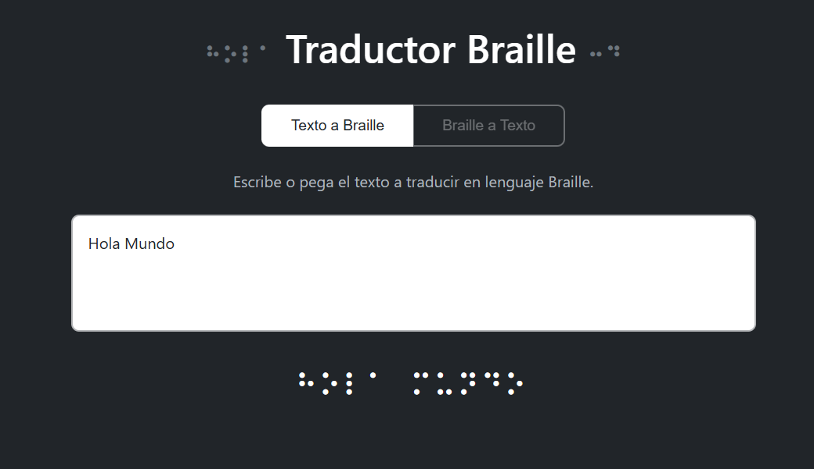

<div align="center">
  <h2>Escuela Politecnica Nacional</h2>
  <h3>Facultad de Ingeniería de Sistemas</h3>
  <h4>Construcción y Evolución de Software</h4>
  
  <hr width="60%">
  
  <br>
  
  <table align="center">
    <tr>
      <td><b>Versión:</b></td>
      <td>1.0</td>
    </tr>
    <tr>
      <td><b>Grupo:</b></td>
      <td>5</td>
    </tr>
    <tr>
      <td><b>Fecha:</b></td>
      <td>Noviembre 2025</td>
    </tr>
  </table>
</div>

<div style="page-break-after: always;"></div>

---

# Manual de Usuario

## Visión general

Aplicación web para convertir texto normal a símbolos Braille Unicode.
Interfaz sencilla y un endpoint REST para conversión.

## Requisitos

- Python 3.7 o superior
- `pip`
- (Opcional) Entorno virtual

## Instalación (Windows - CMD)

1. Clona el repositorio o descarga los archivos.
2. Crea y activa un entorno virtual:

```cmd
python -m venv .venv
.venv\Scripts\activate.bat
```

3. Instala dependencias:

```cmd
pip install -r requirements.txt
```

## Ejecutar la aplicación

```cmd
python app.py
```

Abre `http://localhost:5000` en tu navegador.

## Uso — Interfaz Web
Al iniciar el servicio web, se vera la siguiente pantalla: 


### Conversión de Texto

1. **Escribir o pegar texto**: Introduce el texto que deseas convertir en el área de entrada.
2. **Conversión automática**: La traducción a Braille se realiza instantáneamente mientras escribes.
3. **Visualización del resultado**: El texto convertido aparece en la sección "Resultado en Braille".



### Funcionalidades Adicionales

#### 📋 Copiar Texto en Braille

- Haz clic en el botón **"📋 Copiar"** ubicado en la parte superior del área de resultado.
- El texto en Braille se copiará automáticamente al portapapeles.
- Verás una confirmación visual: el botón cambiará a "✅ ¡Copiado!" durante 2 segundos.
- Ahora puedes pegar el texto Braille en cualquier otra aplicación (Ctrl+V).

#### 🖼️ Exportar como Imagen PNG

- Haz clic en el botón **"🖼️ Exportar PNG"** junto al botón de copiar.
- El sistema generará automáticamente una imagen profesional que incluye:
  - Título "Traducción a Braille"
  - Tu texto original
  - La traducción en símbolos Braille (fuente grande y legible)
  - Marca de agua "Generado por BraiLator"
- La imagen se descargará automáticamente con el nombre: `braille-traduccion-[fecha-hora].png`
- El formato PNG permite alta calidad y es ideal para imprimir o compartir.

**Casos de uso para exportar PNG:**
- Crear material educativo
- Generar señalética en Braille
- Compartir traducciones en redes sociales
- Documentar conversiones para proyectos
- Imprimir referencias de Braille


## Accesibilidad

- La interfaz usa texto grande (32px) para la salida en Braille, facilitando la lectura.
- Los botones tienen iconos visuales y texto descriptivo.
- Se recomienda probar con lectores de pantalla y aumentar el tamaño de la fuente si es necesario.
- Las imágenes PNG exportadas usan fuente grande (32px) para mejor legibilidad.

## Solución de Problemas

### No se puede copiar el texto
- Asegúrate de que tu navegador tiene permisos para acceder al portapapeles.
- Prueba con otro navegador moderno (Chrome, Firefox, Edge).

### No se descarga la imagen PNG
- Verifica que tu navegador permite descargas automáticas.
- Revisa la carpeta de descargas de tu sistema.
- Asegúrate de tener conexión a internet (para cargar la librería html2canvas).

### El texto en Braille no se ve correctamente
- Actualiza tu navegador a la última versión.
- Asegúrate de que tu sistema tiene fuentes Unicode instaladas.

## Consejos a futuro

- Para grandes volúmenes de texto, considerar paginar la conversión o procesar por lotes.
- Validar entrada en aplicaciones que usen la API para evitar strings muy largos o maliciosos.


