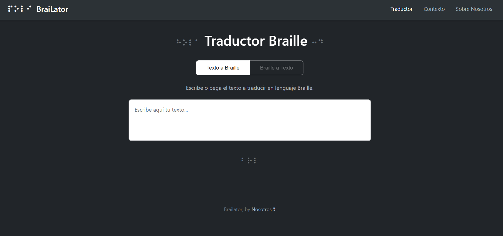
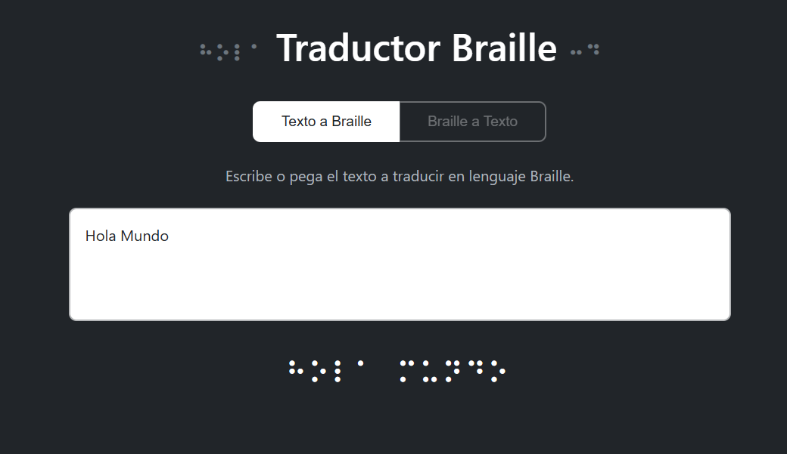

<div align="center">
  <h2>Escuela Politecnica Nacional</h2>
  <h3>Facultad de Ingeniería de Sistemas</h3>
  <h4>Construcción y Evolución de Software</h4>
  
  <hr width="60%">
  
  <br>
  
  <table align="center">
    <tr>
      <td><b>Versión:</b></td>
      <td>1.0</td>
    </tr>
    <tr>
      <td><b>Grupo:</b></td>
      <td>5</td>
    </tr>
    <tr>
      <td><b>Fecha:</b></td>
      <td>Noviembre 2025</td>
    </tr>
  </table>
</div>

<div style="page-break-after: always;"></div>

---

# Manual de Usuario

## Visión general

Aplicación web para convertir texto normal a símbolos Braille Unicode.
Interfaz sencilla y un endpoint REST para conversión.

## Requisitos

- Python 3.7 o superior
- `pip`
- (Opcional) Entorno virtual

## Instalación (Windows - CMD)

1. Clona el repositorio o descarga los archivos.
2. Crea y activa un entorno virtual:

```cmd
python -m venv .venv
.venv\Scripts\activate.bat
```

3. Instala dependencias:

```cmd
pip install -r requirements.txt
```

## Ejecutar la aplicación

```cmd
python app.py
```

Abre `http://localhost:5000` en tu navegador.

## Uso — Interfaz Web

Al iniciar el servicio web, verás la nueva interfaz con pestañas:



### Pestaña: Texto → Braille (Traductor)

1. **Escribir o pegar texto**: Introduce el texto que deseas convertir en el área de entrada.
2. **Conversión automática**: La traducción a Braille se realiza instantáneamente mientras escribes.
3. **Visualización**: El resultado aparece abajo con una animación de cursor.

### Pestaña: Braille → Texto (Nuevo)

Esta sección permite la entrada inversa:

1. **Entrada Interactiva**: Usa las casillas de verificación (6 puntos) para formar caracteres.
2. **Teclado Braille Virtual**:
   - Usa tu teclado numérico (Numpad) para activar los puntos:
     - 7, 8 (Puntos 1, 4)
     - 4, 5 (Puntos 2, 5)
     - 1, 2 (Puntos 3, 6)
   - Presiona `Enter` para confirmar el carácter.
3. **Modos de Validación**:
   - **Modo Letra**: Para escritura normal.
   - **Modo Número**: Valida dígitos numéricos.
   - **Modo Carácter**: Para signos especiales.



### Funcionalidades Adicionales

#### 💾 Descargar Word Braille (Formato Espejo)

Ideal para impresión y perforado manual:

- Haz clic en **"Descargar Word Braille (Espejo)"**.
- Recibirás un archivo `.docx` con el texto invertido horizontalmente.
- **Instrucciones**: Imprime, voltea la hoja y perfora los puntos desde atrás. Al girarla, se leerá correctamente.

#### 📋 Copiar Texto en Braille

- Haz clic en el botón **"Copiar Texto"** (si está disponible) o selecciona el texto resultante.
- En la pestaña Braille → Texto, hay botones específicos para descargar el resultado en `.txt`.

#### 🖼️ Exportar como Imagen PNG

- Haz clic en el botón de exportar imagen (si aplica en la vista actual).
- Genera una imagen limpia con el texto y su traducción.

**Casos de uso para exportar:**

- Crear material educativo
- Generar plantillas de perforado
- Compartir traducciones rápidas

## Accesibilidad

- La interfaz usa texto grande (32px) para la salida en Braille, facilitando la lectura.
- Los botones tienen iconos visuales y texto descriptivo.
- Se recomienda probar con lectores de pantalla y aumentar el tamaño de la fuente si es necesario.
- Las imágenes PNG exportadas usan fuente grande (32px) para mejor legibilidad.

## Solución de Problemas

### No se puede copiar el texto

- Asegúrate de que tu navegador tiene permisos para acceder al portapapeles.
- Prueba con otro navegador moderno (Chrome, Firefox, Edge).

### No se descarga la imagen PNG

- Verifica que tu navegador permite descargas automáticas.
- Revisa la carpeta de descargas de tu sistema.
- Asegúrate de tener conexión a internet (para cargar la librería html2canvas).

### El texto en Braille no se ve correctamente

- Actualiza tu navegador a la última versión.
- Asegúrate de que tu sistema tiene fuentes Unicode instaladas.

## Consejos a futuro

- Para grandes volúmenes de texto, considerar paginar la conversión o procesar por lotes.
- Validar entrada en aplicaciones que usen la API para evitar strings muy largos o maliciosos.
