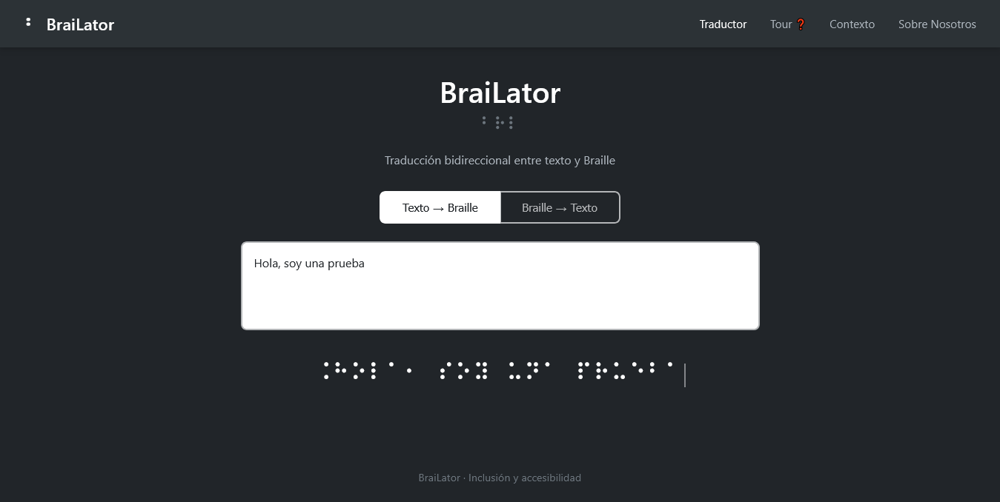

<div align="center">
  <h2>Escuela Politecnica Nacional</h2>
  <h3>Facultad de Ingeniería de Sistemas</h3>
  <h4>Construcción y Evolución de Software</h4>
  
  <hr width="60%">
  
  <br>
  
  <table align="center">
    <tr>
      <td><b>Versión:</b></td>
      <td>2.0</td>
    </tr>
    <tr>
      <td><b>Grupo:</b></td>
      <td>5</td>
    </tr>
    <tr>
      <td><b>Fecha:</b></td>
      <td>Enero 2026</td>
    </tr>
  </table>
</div>

<div style="page-break-after: always;"></div>

---

# Manual de Usuario

## Visión general

BraiLator es una aplicación web para convertir texto normal a símbolos Braille Unicode y viceversa, permitiendo la traducción bidireccional. La interfaz es sencilla y cuenta con funcionalidades avanzadas como validación contextual, tour interactivo y exportación en múltiples formatos.

## Requisitos

- Python 3.7 o superior
- `pip`
- (Opcional) Entorno virtual

## Instalación (Windows - CMD)

1. Clona el repositorio o descarga los archivos.
2. Crea y activa un entorno virtual:

```cmd
python -m venv .venv
.venv\Scripts\activate.bat
```

3. Instala dependencias:

```cmd
pip install -r requirements.txt
```

## Ejecutar la aplicación

```cmd
python app.py
```

Abre `http://localhost:5000` en tu navegador.

## Uso — Interfaz Web

Al iniciar el servicio web, verás la nueva interfaz con pestañas:


---

## Pestaña: Texto → Braille (Traductor)

Esta es la funcionalidad más sencilla de la aplicación.

### Paso 1: Escribir o pegar texto

Introduce el texto que deseas convertir en el área de entrada. Puedes escribir o pegar desde el portapapeles.

### Paso 2: Conversión automática

La traducción a Braille se realiza **instantáneamente mientras escribes**. No necesitas presionar ningún botón adicional.

### Paso 3: Visualización

El resultado aparece abajo con una animación de cursor parpadeante similar a Microsoft Word, lo que da una sensación de escritura en tiempo real.



**Características del área de salida:**
- Fuente grande (32px) para mejor legibilidad
- Cursor animado que indica actividad
- Soporte completo para caracteres Unicode Braille

---

## Pestaña: Braille → Texto (Traducción Inversa)

Esta sección permite la entrada de caracteres Braille para traducirlos a texto normal.

---

### 🎓 Tour Interactivo (¡RECOMENDADO PARA NUEVOS USUARIOS!)

Antes de comenzar a usar la traducción inversa, **recomendamos encarecidamente** hacer clic en el botón **"Tour ❓"** ubicado en el menú de navegación superior.

#### ¿Qué incluye el Tour?

El Tour Interactivo es una guía visual paso a paso que muestra:

1. **Mapeo del teclado numpad** a los 6 puntos Braille
2. **Distribución espacial** del patrón 2×3 estándar Braille
3. **Instrucciones de uso** con ejemplos prácticos
4. **Código visual** de cada tecla

**Aspecto del Tour:**

```
⌨️ Mapeo de Teclado (Numpad)
Usa tu teclado numérico para marcar los puntos:

  7 ➝ ●1    8 ➝ ●4
  4 ➝ ●2    5 ➝ ●5
  1 ➝ ●3    2 ➝ ●6

El punto 1 comienza arriba a la izquierda.
```

**Cómo usar el Tour:**
1. Haz clic en **"Tour ❓"** en el menú de navegación
2. El sistema te cambiará automáticamente a la pestaña "Braille → Texto"
3. Aparecerá un tooltip informativo junto a las casillas Braille
4. Las casillas se resaltarán con un borde amarillo
5. Haz clic en la **"×"** del tooltip para cerrar el tour

**Nota importante:** El tour está diseñado para ser consultado cada vez que necesites recordar el mapeo de teclas. No es intrusivo y puedes cerrarlo en cualquier momento.

---

### 1. Selección de Modo de Entrada

BraiLator cuenta con **tres modos de validación** que aseguran que los caracteres Braille ingresados sean correctos según el contexto:

#### Modo Letra (Atajo: tecla `9`)
- **Uso**: Para escritura normal de letras (a-z), ñ, vocales acentuadas y signos de puntuación básicos
- **Indicador visual**: Fondo blanco con borde gris
- **Validación**: Solo acepta patrones Braille que representen letras válidas
- **Mensaje de ayuda**: "Modo LETRA activo (9) - Presiona Enter para confirmar cada letra"

#### Modo Número (Atajo: tecla `6`)
- **Uso**: Para escritura exclusiva de dígitos (0-9)
- **Indicador visual**: Fondo amarillo con borde dorado
- **Validación**: Solo acepta patrones Braille que representen números
- **Comportamiento especial**: Añade automáticamente el prefijo numérico (⠼) al activarse
- **Mensaje de ayuda**: "Modo NÚMERO activo (6) - Presiona Enter para confirmar cada carácter"

#### Modo Carácter Especial (Atajo: tecla `3`)
- **Uso**: Para signos de puntuación, paréntesis y símbolos especiales
- **Indicador visual**: Fondo verde con borde verde oscuro
- **Validación**: Acepta caracteres especiales reconocidos
- **Mensaje de ayuda**: "Modo CARÁCTER ESPECIAL activo (3) - Presiona Enter para confirmar"

**💡 Tip profesional**: Los números entre paréntesis (9, 6, 3) son atajos de teclado. Puedes cambiar de modo rápidamente sin usar el mouse.

---

### 2. Entrada de Caracteres Braille

Existen **tres métodos** para ingresar caracteres Braille:

#### Método A: Casillas Interactivas (Manual)

Las casillas se organizan en un patrón de **2 columnas × 3 filas**, siguiendo el estándar Braille:

```
●1  ●4
●2  ●5
●3  ●6
```

**Cómo usar:**
1. Haz clic en las casillas que deseas activar
2. Las casillas marcadas mostrarán un punto negro central
3. Presiona `Enter` para confirmar el carácter

**Ejemplo: Letra "l"**
- Marcar: ●1, ●2, ●3 (columna izquierda completa)
- Presionar `Enter`
- Resultado: ⠇ (letra "l")

#### Método B: Teclado Numpad (Recomendado)

Este es el método **más rápido y eficiente**, especialmente para usuarios avanzados.

**Mapeo de teclas:**

| Tecla Numpad | Punto Braille | Posición Visual |
|--------------|---------------|-----------------|
| `7` | Punto 1 | Arriba izquierda |
| `4` | Punto 2 | Medio izquierda |
| `1` | Punto 3 | Abajo izquierda |
| `8` | Punto 4 | Arriba derecha |
| `5` | Punto 5 | Medio derecha |
| `2` | Punto 6 | Abajo derecha |

**Instrucciones de uso:**
1. Presiona las teclas correspondientes para **activar/desactivar** puntos
2. Cada tecla actúa como un interruptor (toggle)
3. Presiona `Enter` cuando el patrón esté completo
4. El carácter se agregará a la palabra

**Ejemplo práctico: Escribir "hola"**

```
Letra "h" (⠓):
  - Presionar: 7, 4, 5 (puntos 1, 2, 5)
  - Enter

Letra "o" (⠕):
  - Presionar: 7, 8, 2 (puntos 1, 4, 6)
  - Enter

Letra "l" (⠇):
  - Presionar: 7, 4, 1 (puntos 1, 2, 3)
  - Enter

Letra "a" (⠁):
  - Presionar: 7 (punto 1)
  - Enter

Resultado: ⠓⠕⠇⠁ → Traducción: "hola"
```

#### Método C: Pegar Unicode Braille

Si ya tienes texto en Braille Unicode (por ejemplo, copiado de otro documento o generado por la pestaña "Texto → Braille"):

1. **Copiar** el texto Braille desde su fuente original
2. **Pegar** (`Ctrl+V`) en el área de texto debajo de las casillas
3. La traducción aparecerá **automáticamente** en tiempo real

**Nota**: Este método es ideal para verificar traducciones o trabajar con textos Braille existentes.

---

### 3. Botón Block Mayús (🔠 NUEVA FUNCIONALIDAD)

El botón **"Block Mayus"** es una característica avanzada que facilita la escritura de texto en mayúsculas.

#### Ubicación y Apariencia

- **Posición**: A la izquierda de las casillas Braille, en un panel lateral
- **Estados visuales**:
  - **Inactivo**: Fondo gris oscuro (#42494f), texto blanco
  - **Activo**: Fondo rojo brillante (#e74c3c), borde grueso rojo oscuro

#### Funcionamiento

1. **Activación manual**: Haz clic en el botón para activar/desactivar el modo mayúsculas
2. **Sincronización automática**: El botón se sincroniza con la tecla física **Bloq Mayús** de tu teclado
   - Si presionas Bloq Mayús en el teclado, el botón cambiará de estado automáticamente
   - Si haces clic en el botón, la tecla física NO se sincroniza (es solo visual)
3. **Restricción por modo**: Solo funciona en **Modo Letra** (9)
   - Si cambias a Modo Número o Carácter, el botón se desactiva automáticamente

#### Comportamiento Técnico

Cuando Block Mayús está activo:
- Cada letra ingresada recibe el **prefijo de mayúscula** (⠨ U+2828)
- Ejemplo: letra "m" → ⠨⠍ (representa "M" mayúscula)

#### Caso de Uso Típico: Escribir "María"

```
1. Activar Block Mayús (botón se pone rojo)
2. Escribir "m" usando casillas o numpad
   → Se guarda como ⠨⠍ (M mayúscula)
3. Desactivar Block Mayús (botón vuelve a gris)
4. Escribir "a" → ⠁ (a minúscula)
5. Escribir "r" → ⠗ (r minúscula)
6. Escribir "í" → ⠌ (í minúscula)
7. Escribir "a" → ⠁ (a minúscula)

Resultado: ⠨⠍⠁⠗⠌⠁ → Traducción: "María"
```

#### Detección de Estado de Bloq Mayús al Inicio

Cuando cargas la página, el sistema **detecta automáticamente** si la tecla Bloq Mayús está activa y ajusta el botón en consecuencia.

---

### 4. Confirmar y Validar Caracteres

Una vez que hayas formado un patrón Braille (ya sea con casillas, numpad o ambos):

#### Paso 1: Presionar `Enter`

Al presionar Enter, el sistema:
1. **Genera el carácter Braille** correspondiente al patrón marcado
2. **Valida** si el carácter es correcto según el modo activo
3. **Añade el prefijo** correspondiente (mayúscula si Block Mayús está activo, numérico si está en modo número)
4. **Agrega el carácter** a la palabra en construcción

#### Paso 2: Ver Feedback Visual

El sistema muestra mensajes de validación con colores distintivos:

**✅ Mensaje de éxito** (fondo azul claro):
```
"Carácter agregado correctamente"
```

**❌ Mensaje de error** (fondo rojo claro):
```
Ejemplos de errores:
- "No has marcado ningún punto"
- "No es una letra o signo válido en modo letra"
- "No es un número Braille válido (0-9)"
- "No es un carácter especial reconocido"
```

Los mensajes aparecen debajo de las casillas y **desaparecen automáticamente** después de 3 segundos.

#### Paso 3: Continuar o Limpiar

- **Continuar**: Las casillas se limpian automáticamente, puedes seguir escribiendo
- **Limpiar todo**: Presiona `Escape` para reiniciar completamente

---

### 5. Visualización de la Traducción

A medida que escribes, la traducción aparece en dos áreas:

#### Área Braille (parte superior)
- Muestra el texto Braille que has construido
- Incluye todos los prefijos (mayúsculas, números)
- Editable: Puedes pegar o editar manualmente

#### Área de Traducción (parte inferior)
- Muestra el texto traducido a español
- Actualización en **tiempo real**
- Solo lectura (readonly)

---

### 6. Descargar Resultados

BraiLator ofrece dos opciones de descarga:

#### 💾 Descargar Texto (.txt)

**Descripción**: Descarga un archivo de texto plano con la traducción en español.

**Uso**:
1. Haz clic en el botón **"Descargar Texto"**
2. El navegador descargará `traduccion.txt`
3. Contenido: Solo el texto traducido (sin Braille)

**Caso de uso**: Ideal para documentación escrita o para compartir con personas que no leen Braille.

#### 📄 Descargar Word Braille (Espejo)

**Descripción**: Genera un documento Word (.docx) con el texto Braille **invertido horizontalmente** y con el **orden de caracteres invertido**, optimizado para perforación manual desde el reverso del papel.

**¿Por qué "espejo"?**

El Braille táctil se perfora desde el **reverso** del papel. Al invertir horizontalmente cada celda y revertir el orden de lectura, cuando voltees la hoja, los puntos estarán en la orientación correcta para lectura táctil.

**Contenido del documento:**

1. **Página 1: Braille para Perforar**
   - Encabezado con instrucciones claras
   - Texto Braille en formato espejo (fuente grande 24pt)
   - Listo para imprimir y perforar

2. **Página 2: Referencia de Texto Original**
   - Título: "TEXTO ORIGINAL (Referencia)"
   - El texto en español para verificación
   - Fuente estándar 12pt

**Instrucciones de uso físico:**
```
⚠️ INSTRUCCIONES PARA PERFORAR ⚠️

Este documento contiene Braille en formato ESPEJO.

1. Imprime este documento
2. Voltea la hoja
3. Perfora desde el reverso siguiendo los puntos
4. Al dar vuelta la hoja, se leerá correctamente
```

**Uso**:
1. Haz clic en **"Descargar Word Braille (Espejo)"**
2. Se descarga `braille_para_perforar.docx`
3. Imprimir el documento
4. Usar punzón o máquina perforadora desde el reverso

**Caso de uso**: Creación de material didáctico táctil, señalética Braille, documentos de aprendizaje.

---

## ⌨️ Referencia Completa de Atajos de Teclado

Esta sección lista **todos** los atajos disponibles en la pestaña "Braille → Texto":

### Cambio de Modo

| Tecla | Acción | Efecto Visual |
|-------|--------|---------------|
| `9` | Activar Modo Letra | Botón blanco con borde gris |
| `6` | Activar Modo Número | Botón amarillo, añade prefijo ⠼ |
| `3` | Activar Modo Carácter | Botón verde |

### Entrada de Puntos Braille

| Tecla | Punto | Posición |
|-------|-------|----------|
| `7` | Punto 1 | ⬆️ Arriba izquierda |
| `4` | Punto 2 | ⬅️ Medio izquierda |
| `1` | Punto 3 | ⬇️ Abajo izquierda |
| `8` | Punto 4 | ⬆️ Arriba derecha |
| `5` | Punto 5 | ➡️ Medio derecha |
| `2` | Punto 6 | ⬇️ Abajo derecha |

### Acciones Especiales

| Tecla | Acción | Descripción |
|-------|--------|-------------|
| `Enter` | Confirmar carácter | Valida y agrega el carácter a la palabra |
| `Escape` | Limpiar todo | Borra palabra, limpia casillas, vuelve a Modo Letra |
| `Bloq Mayús` | Sincronizar mayúsculas | Activa/desactiva Block Mayús (solo en Modo Letra) |

**Notas importantes:**
- Los atajos solo funcionan cuando la pestaña "Braille → Texto" está **activa**
- La tecla Bloq Mayús se detecta automáticamente al cargar la página
- Las teclas del numpad actúan como **interruptores** (toggle on/off)

---

## Accesibilidad

BraiLator ha sido diseñado con principios de accesibilidad universal:

### Características de Accesibilidad

1. **Tipografía grande**: 
   - Salida Braille: 32px (2rem)
   - Textos de interfaz: 16px mínimo

2. **Alto contraste**:
   - Fondo oscuro (#212529) con texto claro (#ecf0f1)
   - Botones con estados visuales claros
   - Mensajes de error en rojo suave, éxito en azul claro

3. **Navegación por teclado completa**:
   - Todos los atajos documentados
   - Sin dependencia del mouse para funciones principales

4. **Compatibilidad con lectores de pantalla**:
   - Etiquetas semánticas en HTML
   - Textos descriptivos en botones
   - Mensajes de estado legibles

5. **Responsive design**:
   - Funciona en móviles, tablets y desktop
   - Botones se reorganizan en pantallas pequeñas

### Recomendaciones de Uso

- **Navegadores recomendados**: Chrome, Firefox, Edge (versiones recientes)
- **Resolución mínima**: 1024×768 para experiencia óptima
- **Teclado numérico**: Esencial para entrada eficiente (puede ser externo en laptops)

---

## Solución de Problemas

### No se puede copiar el texto

**Síntoma**: Al hacer clic en "Copiar" no pasa nada o aparece error.

**Soluciones**:
1. Verifica que tu navegador tiene permisos para acceder al portapapeles
2. En Chrome: `chrome://settings/content/clipboard` → Permitir para localhost
3. Prueba con otro navegador moderno (Firefox, Edge)
4. Como alternativa, selecciona el texto manualmente y copia con `Ctrl+C`

### No se descarga el archivo Word

**Síntoma**: Al hacer clic en "Descargar Word Braille (Espejo)" no se descarga nada.

**Soluciones**:
1. Verifica que tu navegador permite descargas automáticas
2. Revisa la carpeta de descargas de tu sistema
3. Verifica que no hay ningún bloqueador de popups activo
4. Asegúrate de haber escrito al menos un carácter Braille

### El texto en Braille no se ve correctamente

**Síntoma**: Los caracteres Braille aparecen como cuadrados o símbolos extraños.

**Soluciones**:
1. Actualiza tu navegador a la última versión
2. Asegúrate de que tu sistema tiene fuentes Unicode instaladas
3. En Windows: Verifica que "Segoe UI Symbol" está disponible
4. Prueba con otro navegador

### Las casillas no responden

**Síntoma**: Al hacer clic en las casillas Braille no se marcan.

**Soluciones**:
1. Verifica que estás en la pestaña "Braille → Texto"
2. Recarga la página (`F5`)
3. Limpia la caché del navegador
4. Verifica la consola de JavaScript (`F12`) por errores

### El teclado numpad no funciona

**Síntoma**: Las teclas del numpad no marcan las casillas.

**Soluciones**:
1. Verifica que **Bloq Num** (Num Lock) está **activado** en tu teclado
2. Verifica que estás en la pestaña "Braille → Texto" (las teclas solo funcionan ahí)
3. Si usas laptop sin numpad, conecta un teclado numérico externo
4. Como alternativa, usa las casillas interactivas con el mouse

### El botón Block Mayús no se activa

**Síntoma**: Al hacer clic en "Block Mayus" el botón no cambia de color.

**Soluciones**:
1. Verifica que estás en **Modo Letra** (el botón solo funciona en este modo)
2. Si cambiaste a Modo Número o Carácter, vuelve a Modo Letra presionando `9`
3. Intenta presionar la tecla física Bloq Mayús para sincronizar

### La traducción no aparece

**Síntoma**: Después de presionar Enter, no se traduce el carácter.

**Soluciones**:
1. Verifica que has marcado al menos un punto en las casillas
2. Revisa el mensaje de error que aparece debajo de las casillas
3. Asegúrate de estar en el modo correcto (letra/número/carácter)
4. Si el patrón no es válido, aparecerá un mensaje de error descriptivo

---

## Casos de Uso Avanzados

### Caso 1: Crear Señalética para Ascensor

**Objetivo**: Crear una etiqueta Braille que diga "Piso 3"

**Pasos**:
1. Ir a pestaña "Braille → Texto"
2. Activar Block Mayús (para "P" mayúscula)
3. Escribir "P" (usando casillas o numpad)
4. Desactivar Block Mayús
5. Escribir "iso " (incluir espacio)
6. Presionar `6` para activar Modo Número
7. Escribir "3"
8. Descargar Word Braille (Espejo)
9. Imprimir y perforar desde el reverso

**Resultado**: ⠨⠏⠊⠎⠕⠀⠼⠉ → "Piso 3"

### Caso 2: Verificar una Traducción Existente

**Objetivo**: Comprobar que un texto Braille que recibiste se traduce correctamente.

**Pasos**:
1. Copiar el texto Braille desde el documento original
2. Ir a pestaña "Braille → Texto"
3. Pegar el texto Braille directamente en el área de texto
4. Revisar la traducción automática que aparece abajo

### Caso 3: Práctica de Escritura Braille

**Objetivo**: Aprender a escribir tu nombre en Braille.

**Pasos**:
1. Abrir el Tour (botón "Tour ❓") para ver el mapeo de teclas
2. Escribir tu nombre letra por letra usando el numpad
3. Si tiene mayúscula inicial, activar Block Mayús
4. Verificar la traducción en tiempo real
5. Copiar el resultado y guardarlo

---

## Consejos de Productividad

### Para Usuarios Nuevos

1. **Comienza con el Tour**: No te saltes esta funcionalidad, te ahorrará mucho tiempo
2. **Practica con palabras cortas**: Empieza con "hola", "casa", "sol"
3. **Usa el Modo Letra al principio**: Es el más intuitivo
4. **Memoriza el numpad**: Con práctica, será muy rápido

### Para Usuarios Avanzados

1. **Usa solo el teclado**: Los atajos son más rápidos que el mouse
2. **Memoriza los patrones**: Aprende los patrones visuales de letras comunes
3. **Usa Block Mayús estratégicamente**: Para nombres propios y siglas
4. **Aprovecha el pegado directo**: Para trabajar con textos largos

### Para Educadores

1. **Exporta en Word**: Crea material didáctico fácilmente
2. **Usa la validación contextual**: Ayuda a los estudiantes a identificar errores
3. **Combina ambas pestañas**: Texto → Braille para verificación, Braille → Texto para práctica
4. **Imprime material táctil**: Usa la función de espejo para crear recursos físicos

---

## Notas Técnicas Avanzadas

### Sobre el Sistema Braille Implementado

- **Grado**: Braille Grado 1 (literal)
- **Idioma**: Español de España (con soporte para América Latina)
- **Estándar Unicode**: U+2800 a U+28FF (Braille Patterns)
- **Prefijos**:
  - Mayúscula: ⠨ (U+2828)
  - Número: ⠼ (U+283C)

### Limitaciones Conocidas

1. **No soporta Braille Grado 2** (contracciones): Cada letra es literal
2. **Sin soporte de música Braille**: Solo texto
3. **Sin matemáticas Braille**: No soporta notación matemática especializada
4. **Caracteres no soportados**: Emojis y símbolos raros se mantienen como están

### Sobre la Exportación a Word

- **Formato**: DOCX (Office Open XML)
- **Librería usada**: python-docx
- **Compatibilidad**: Word 2007 o superior, LibreOffice, Google Docs
- **Proceso de espejo**:
  1. Inversión horizontal de cada celda (intercambio de columnas)
  2. Reversión del orden completo de la cadena
- **Codificación**: UTF-8 con soporte completo Unicode

---

## Preguntas Frecuentes (FAQ)

### ¿Por qué necesito el Tour?

El mapeo del teclado numpad no es intuitivo al principio. El Tour te muestra visualmente qué tecla corresponde a qué punto, acelerando tu curva de aprendizaje.

### ¿Puedo usar BraiLator sin teclado numérico?

Sí, puedes usar las casillas interactivas con el mouse. Sin embargo, para escritura rápida, recomendamos un teclado numérico externo (USB).

### ¿El Word generado funciona en LibreOffice?

Sí, el formato DOCX es compatible con LibreOffice Writer y Google Docs. Los caracteres Braille se preservan correctamente.

### ¿Puedo editar el Braille después de escribirlo?

Sí, el área de texto Braille es completamente editable. Puedes agregar, eliminar o modificar caracteres manualmente.

### ¿Por qué el Block Mayús no funciona en Modo Número?

Las mayúsculas son un concepto de letras, no de números. El sistema lo desactiva automáticamente para evitar confusión.

### ¿Qué pasa si presiono Enter sin marcar ningún punto?

El sistema mostrará un mensaje de error: "No has marcado ningún punto". Las casillas permanecerán vacías hasta que marques al menos un punto.

---

## Recursos Adicionales

### Enlaces Útiles

- **Repositorio GitHub**: [Braile_checked_web](https://github.com/Construccion-y-Evolucion-Pry/Braile_checked_web)
- **Documentación Sphinx**: Ver `Documentation/build/html/index.html`
- **Estándar Braille Unicode**: [Unicode.org - Braille Patterns](https://www.unicode.org/charts/PDF/U2800.pdf)

### Material de Aprendizaje

- **Casos de prueba**: Ver `casos_de_prueba_unitarios.md` para ejemplos de traducción
- **Diseño arquitectónico**: Ver `diseno_arquitectonico.md` para entender cómo funciona internamente

---

## Registro de Cambios

### Versión 2.0 (Enero 2026)
- ✅ Añadido Tour Interactivo con mapeo visual de teclado
- ✅ Implementado botón Block Mayús con sincronización automática
- ✅ Añadidos atajos de teclado (9, 6, 3) para cambio de modo
- ✅ Mejorada validación contextual con mensajes descriptivos
- ✅ Añadida funcionalidad de limpieza con tecla Escape
- ✅ Actualizada documentación completa

### Versión 1.0 (Noviembre 2025)
- ✅ Traducción bidireccional Texto ↔ Braille
- ✅ Tres modos de validación (Letra, Número, Carácter)
- ✅ Entrada por casillas interactivas
- ✅ Entrada por teclado numpad
- ✅ Exportación a Word en formato espejo
- ✅ 70 casos de prueba automatizados

---

## Soporte y Contacto

Si encuentras algún problema o tienes sugerencias de mejora:

1. **GitHub Issues**: [Reportar problema](https://github.com/Construccion-y-Evolucion-Pry/Braile_checked_web/issues)
2. **Documentación**: Consulta primero los documentos en `/Documentation`
3. **Prueba los casos de prueba**: Ejecuta `python test_braille.py` para verificar el sistema

---

<div align="center">

**BraiLator - Manual de Usuario**  
*Versión 2.0 - Enero 2026*

Desarrollado por Grupo 5  
Escuela Politécnica Nacional

</div>